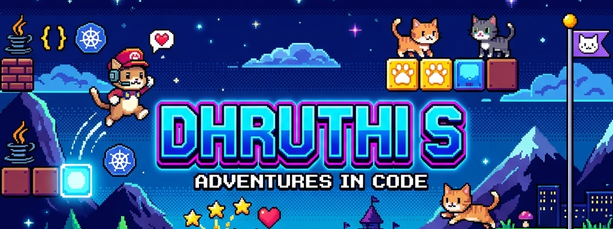

  <!-- Pixel Art Mario & Pokemon Cat Banner -->
  

    

  <!-- Properly Encoded Animated Typing Tagline -->
  

  

    📍 <b>Bengaluru, India</b> &nbsp;•&nbsp; 🏢 <b>Nokia Cloud Operations Manager (NCOM)</b>
  

  <!-- Modern Social Pills -->
  

    
    
    
  

 

<!-- Cat Coding Meme Card Header -->
<table width="100%">
  <tr>
    <td width="65%" valign="top">
      <h3>✨ Welcome to my GitHub Cave! 🐾</h3>
      

        I am an <b>Associate Software Developer</b> at <b>Nokia Solutions and Networks</b> working on the <b>Nokia Cloud Operations Manager (NCOM)</b> platform. I specialize in building Java & Spring Boot microservices, deploying Helm charts on <b>Kubernetes & OpenShift</b>, remediating container security vulnerabilities, and supercharging developer productivity with GenAI tools!
      

      

        🎓 <b>Academics:</b> B.E. in Computer Science & Engineering (Artificial Intelligence) from <b>Sri Venkateshwara College of Engineering / VTU</b> (2020–2024).
      

    </td>
    <td width="35%" align="center" valign="middle">
      
       
      <small><i>"Me writing K8s Helm charts & Spring Boot services"</i></small>
    </td>
  </tr>
</table>

---

### 💼 Work Experience & Achievements

<!-- Nokia Role 1 -->
<table width="100%">
  <tr>
    <td width="100%" style="background-color: #0d1117; border-left: 5px solid #00F2FE; padding: 15px;">
      <table width="100%">
        <tr>
          <td>
            <h3 style="margin:0;">📡 Nokia Solutions and Networks &nbsp;|&nbsp; Associate Software Developer</h3>
            
📅 <code>Dec 2024 - Present</code> &nbsp;•&nbsp; 📍 <i>Bengaluru, India</i> &nbsp;•&nbsp; 🏷️ <b>Nokia Cloud Operations Manager (NCOM)</b>

          </td>
          <td align="right" valign="top">
            
          </td>
        </tr>
      </table>
      <ul>
        <li><b>Microservices & Core Component Ownership:</b> Engineered Java & Spring Boot microservices, served as primary owner for core component (<code>Calm-custom</code>), leading installation, upgrades, rollbacks, and release validation.</li>
        <li><b>K8s Deployments & Performance Tuning:</b> Designed Helm-based deployments across Kubernetes and OpenShift, optimized API-server load using read-only ConfigMaps & Secrets, and built a <b>CNF validation feature</b> for system correctness.</li>
        <li><b>DevOps & Container Security:</b> Remediated 14+ CVEs using Anchore & VAMS, upgraded critical framework dependencies (Spring, Go modules, Jetty), and rebuilt base container images on <b>Rocky Linux OS</b>.</li>
        <li><b>GenAI Workflow Automation & Quality:</b> Integrated GenAI developer tools (Claude Code, GitHub Copilot, Cursor, Antigravity, MCPs) into daily setups and automated Jenkins CI/CD pipelines, driving JUnit/Mockito test coverage from 44% toward a <b>≥70% SonarQube quality gate</b>.</li>
      </ul>
      

        
        
        
        
        
        
        
        
        
        
      

    </td>
  </tr>
</table>

 

<!-- Nokia Role 2 -->
<table width="100%">
  <tr>
    <td width="100%" style="background-color: #0d1117; border-left: 5px solid #7928CA; padding: 15px;">
      <table width="100%">
        <tr>
          <td>
            <h3 style="margin:0;">📡 Nokia Solutions and Networks &nbsp;|&nbsp; Student Intern</h3>
            
📅 <code>Oct 2023 - Jul 2024</code> &nbsp;•&nbsp; 📍 <i>Bengaluru, India</i> &nbsp;•&nbsp; 🧪 <b>Test Automation & Cloud CI/CD</b>

          </td>
          <td align="right" valign="top">
            
          </td>
        </tr>
      </table>
      <ul>
        <li><b>Test Automation & BDD Frameworks:</b> Authored BDD UI test feature files using Cucumber and engineered modular test automation scripts in Python utilizing Robot Framework.</li>
        <li><b>Distributed AWS Execution & Analytics:</b> Architected cloud-native regression execution workflows on <b>AWS EC2</b> for distributed test runs paired with <b>AWS S3</b> for centralized log analytics.</li>
        <li><b>Jenkins CI/CD Pipeline Automation:</b> Integrated automated regression job triggers and data-loading routines into Jenkins pipelines, cutting manual setup overhead and increasing daily test throughput.</li>
        <li><b>Defect Triage & Agile Scrum:</b> Executed daily sanity and full-scale regression suites, systematically triaging defect reports (NOKs) on Jira to accelerate developer fixes within Scrum sprints.</li>
      </ul>
      

        
        
        
        
        
        
        
      

    </td>
  </tr>
</table>

---

### 🛠️ Tech Stack & Skill Matrix

  

 

<table width="100%">
  <tr>
    <td width="50%" valign="top">
      <h4>☁️ Cloud & Containers</h4>
      

        
        
        
        
        
      

      <h4>⚡ Backend & Languages</h4>
      

        
        
        
        
        
        
      

    </td>
    <td width="50%" valign="top">
      <h4>🛡️ DevOps & Security</h4>
      

        
        
        
        
        
        
      

      <h4>🤖 AI/ML & Developer Tools</h4>
      

        
        
        
        
        
        
      

    </td>
  </tr>
</table>

---

### 📜 Certifications, Languages & Research Paper

<table width="100%">
  <tr>
    <td width="55%" valign="top">
      <h4>📄 Published Research Paper (IJRAR)</h4>
      

        <h5 style="margin: 0;">🩺 “Lung Cancer Diagnosis Model (CNN-ALCD)”</h5>
        
<small>Published in <i>International Journal of Research and Analytical Reviews (IJRAR)</i>, Vol. 11, Issue 2, May 2024.</small>

        
Deep learning classification pipeline using custom CNNs achieving <b>95% accuracy</b> and <b>99.9% specificity</b> on CT scan datasets.

        
      

    </td>
    <td width="45%" valign="top">
      <h4>☁️ Certifications & 🗣️ Languages</h4>
      <ul>
        <li>☁️ <b>CKAD</b> (Certified Kubernetes Application Developer) – <i>Pursuing</i></li>
        <li>☁️ <b>Microsoft Certified:</b> Azure Fundamentals (AZ-900)</li>
      </ul>
      

      
🗣️ <b>Languages Spoken:</b>

      
🇬🇧 <b>English</b> (Full Professional) &nbsp;|&nbsp; 🇮🇳 <b>Kannada</b> (Native) 🇮🇳 <b>Telugu</b> (Native) &nbsp;|&nbsp; 🇮🇳 <b>Hindi</b> (Beginner)

    </td>
  </tr>
</table>

---

### 📌 Featured Projects

<table width="100%">
  <tr>
    <td width="50%" valign="top">
      

        <h4 align="center">🩺 Lung Cancer Diagnosis Model (CNN-ALCD)</h4>
        

          Deep learning classification pipeline using custom Convolutional Neural Networks (CNN-ALCD) achieving <b>95% accuracy</b> and <b>99.9% specificity</b> on CT scan datasets. Published research paper in IJRAR Journal.
        

        

          <code>Python</code> · <code>TensorFlow</code> · <code>CNNs</code> · <code>OpenCV</code>
        

        

          
        

      

    </td>
    <td width="50%" valign="top">
      

        <h4 align="center">🍽️ Online Restaurant Reservation System</h4>
        

          Full-stack interactive web application enabling user registration, table booking, and QR-based validation, improving check-in efficiency and reducing server response latency.
        

        

          <code>PHP</code> · <code>MySQL</code> · <code>HTML</code> · <code>CSS</code>
        

        

          
        

      

    </td>
  </tr>
</table>

---

<!-- Cat Meme Footer -->

  
   
  

    🐾 <i>"Purr-fecting code, one container at a time!"</i> 🐾
      
    <b>Let's Connect & Build:</b> &nbsp;
    <a href="mailto:dhruthisannu@gmail.com">dhruthisannu@gmail.com</a> &nbsp;•&nbsp; 
    <a href="https://linkedin.com/in/dhruthi-s-692151173">LinkedIn Profile</a> &nbsp;•&nbsp; 
    <a href="https://github.com/DhruthiSannu11">GitHub Profile</a>
  

